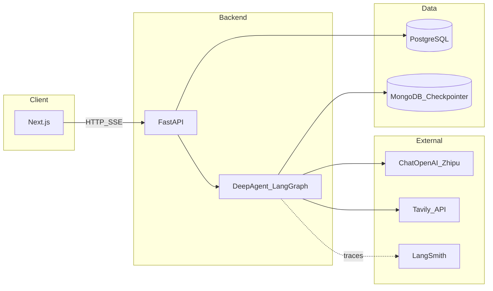

# 系统架构

## 目标

构建基于 **LangChain DeepAgents**（底层 **LangGraph**）的个人助理：Web 单通道聊天；主 Agent 负责日常对话与任务编排；**深度调研 Sub-Agent** 通过 **Tavily** 完成网络检索与综合。一期 **单用户、无登录**。

## 逻辑架构

## 分层说明

| 层 | 职责 |
|----|------|
| **前端** | 会话列表、消息展示、SSE 消费与解析（流式 token、工具步骤、子代理边界事件） |
| **API** | 会话 CRUD（元数据）、聊天流式端点、健康检查、CORS |
| **Agent** | `create_deep_agent` 编译图 + MongoDB checkpointer；主系统提示；Sub-Agent「research」+ Tavily |
| **PostgreSQL** | 业务元数据：会话标题、时间戳等（见 [data-model.md](./data-model.md)） |
| **MongoDB** | LangGraph **checkpoint**（对话状态与线程恢复），不替代 PG 的业务查询需求 |
| **LangSmith** | 链路追踪与调试（环境变量启用） |

## 核心执行流程（聊天）

1. 前端 `POST` 创建会话或选用已有 `thread_id`（与 checkpoint 一致）。
2. 前端对聊天端点发起 **SSE** 请求，携带 `thread_id` 与用户消息。
3. FastAPI 将图配置为 `thread_id` 对应的 checkpoint，调用 `graph.astream_events` 或 `astream`（实现以 [api-and-streaming.md](./api-and-streaming.md) 为准）。
4. 事件映射为统一 JSON SSE：`token`、`tool_start`、`tool_end`、`subagent`、`message`、`done`、`error`。
5. 主 Agent 在需要深度检索时通过 DeepAgents 的 **task/subagent** 将工作委托给调研 Sub-Agent；子代理仅返回摘要结果给主上下文，减少主线程噪声。

## 与 OpenClaw 的对齐说明

OpenClaw 强调多通道与插件生态；本项目 **一期仅 Web**，对齐其「单助手 + 工具/子任务」体验，不实现多 Channel。
