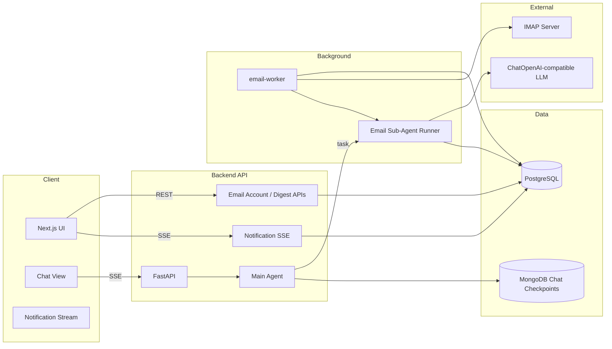

# Email Sub-Agent Design

## Summary

This document defines the phase-one design for an Email Sub-Agent in Deep-Claw.

The feature adds:

- IMAP-based mailbox connection for user-managed email accounts
- scheduled email checking at a user-defined interval
- AI-generated summaries and action suggestions for new email batches
- in-app proactive notification delivery via SSE
- explicit manual email checking from the main chat agent through an `email` subagent

Phase one explicitly excludes Web Push. Notifications are delivered only through an in-app SSE stream.

## Goals

- Let the user connect one or more mailboxes using standard email protocols
- Check the latest emails automatically on a configurable schedule
- Produce structured summaries and next-step suggestions from new emails
- Push in-app notifications when new digest results are available
- Let the main agent delegate explicit email-check requests to a dedicated Email Sub-Agent
- Keep automatic email runs isolated from chat history and LangGraph chat checkpoints

## Non-Goals

- Sending email
- Deleting, moving, archiving, or marking emails as read
- Web Push notifications
- full mailbox UI with folders, search, and attachment preview
- storing raw MIME blobs or large attachments in PostgreSQL
- sharing automatic email execution state through MongoDB chat checkpoints

## Current Project Context

Deep-Claw currently uses:

- FastAPI for REST and SSE APIs
- DeepAgents on top of LangGraph for the main assistant graph
- MongoDB checkpointing for chat threads only
- PostgreSQL for business metadata
- a `research` subagent backed by Tavily

Relevant repository boundaries:

- [architecture.md](../../architecture.md)
- [agent-design.md](../../agent-design.md)
- [api-and-streaming.md](../../api-and-streaming.md)
- [data-model.md](../../data-model.md)
- [backend/app/agent/build.py](../../../backend/app/agent/build.py)
- [backend/app/streaming.py](../../../backend/app/streaming.py)

## Requirements Mapping

### 1. Mailbox connection

The user must be able to connect a mailbox through standard email protocols.

Phase-one decision:

- receive mail through `IMAP over TLS`
- support authentication via `XOAUTH2` or app password
- store account configuration in PostgreSQL
- encrypt credentials before writing them to storage

`SMTP` is deferred because phase one does not include sending.

### 2. Automatic checking and summarization

After mailbox connection, the system checks for new mail and generates:

- a digest summary
- key points
- next-step action suggestions

Delivery mechanism:

- write digest results to `email_digests`
- write corresponding notification records to `notifications`
- stream in-app notifications through a dedicated SSE endpoint

### 3. User-defined checking frequency

Each mailbox stores a polling interval in minutes. The worker uses that interval to compute `next_check_at`.

### 4. Manual checking from the main agent

When the user explicitly asks the main agent to check email, the main agent delegates the request to a dedicated `email` subagent through DeepAgents task delegation.

The manual run may return results directly to the current conversation, but automatic runs must not write execution history into the chat thread.

## Recommended Architecture

The feature is split into four responsibilities:

1. mailbox integration and credential management
2. background email synchronization
3. email analysis through a dedicated Email Sub-Agent
4. notification persistence and SSE delivery

## Key Boundary Decisions

### Automatic email runs are not chat threads

Automatic polling is a system-initiated workflow, not a user conversation. It must not reuse a chat `thread_id` or write into MongoDB chat checkpoints.

Instead:

- fetch and normalize new emails
- analyze them in an isolated execution unit
- persist digest and notification records in PostgreSQL

This keeps automatic email execution out of user-visible conversation history and preserves a clean separation between conversational state and business state.

### Notifications are stored first, streamed second

The source of truth is PostgreSQL, not the SSE connection.

SSE is used only for online delivery. If the browser reconnects, the client can fetch notification history from the database and fill any gap.

### Email tooling is read-only in phase one

The subagent is allowed to inspect and summarize emails only. It is not allowed to mutate mailbox state.

## Detailed Design

### Mailbox Integration

Each connected mailbox is represented as an `email_accounts` record. Phase one supports only `INBOX`.

Configuration includes:

- email address
- provider label
- IMAP host and port
- security mode
- auth type
- encrypted credentials
- polling interval
- enabled/disabled flag

Before saving a new account, the backend performs an IMAP connectivity check.

### Incremental Synchronization Strategy

Incremental sync is based on IMAP `UID`, not timestamps.

For each account and folder, the system tracks:

- `uid_validity`
- `last_seen_uid`
- `last_check_started_at`
- `last_check_finished_at`
- `next_check_at`
- `last_error`

Each run:

1. loads sync state
2. locks the account/state row for execution
3. connects to IMAP and selects `INBOX`
4. validates `UIDVALIDITY`
5. fetches messages with `UID > last_seen_uid`
6. normalizes and stores message data
7. updates sync state and schedules the next run

If `UIDVALIDITY` changes, the worker triggers a controlled resync path instead of silently trusting the old UID cursor.

### Message Normalization

New emails are parsed from MIME into a normalized format suitable for storage and LLM consumption.

Store:

- sender display name and address
- subject
- received timestamp
- unread status
- snippet
- normalized plain text body
- optional sanitized HTML body when useful for display

Do not store:

- full raw MIME payload
- large binary attachments

Attachments may be represented only as metadata in phase one.

### Email Analysis

The Email Sub-Agent receives a bounded batch of newly fetched emails and produces:

- concise summary
- key points
- suggested next actions
- optional priority classification

The analysis prompt must instruct the model to:

- rely only on provided email content
- avoid fabricating missing details
- call out uncertainty when context is incomplete
- focus on practical next steps for the user

Automatic runs use an isolated execution path. Manual runs use the same analysis logic but are initiated through the main agent.

### Notification Delivery

When a digest is created, the backend writes a `notifications` record with:

- notification type
- digest reference
- mailbox reference
- compact display text
- read/unread state

Online clients subscribe to `/api/notifications/stream` and receive `notification` events in real time.

Phase one also provides list and mark-read APIs so the UI can recover after refresh or disconnect.

## Data Model

### `email_accounts`

Stores mailbox connection settings.

Suggested fields:

- `id`
- `email_address`
- `provider_label`
- `imap_host`
- `imap_port`
- `imap_security`
- `auth_type`
- `credential_encrypted`
- `poll_interval_minutes`
- `enabled`
- `last_check_at`
- `created_at`
- `updated_at`

### `email_sync_state`

Stores incremental synchronization cursors and worker state.

Suggested fields:

- `account_id`
- `folder_name`
- `uid_validity`
- `last_seen_uid`
- `last_check_started_at`
- `last_check_finished_at`
- `next_check_at`
- `last_error`

### `email_messages`

Stores normalized messages already fetched from IMAP.

Suggested fields:

- `id`
- `account_id`
- `folder_name`
- `message_uid`
- `message_id_header`
- `from_display`
- `from_address`
- `subject`
- `received_at`
- `is_unread`
- `snippet`
- `body_text`
- `body_html_sanitized`
- `ingested_at`

Suggested uniqueness constraint:

- `(account_id, folder_name, message_uid)`

### `email_digests`

Stores AI-generated digest results for a batch.

Suggested fields:

- `id`
- `account_id`
- `trigger_source`
- `digest_scope`
- `message_ids`
- `summary`
- `key_points_json`
- `action_suggestions_json`
- `priority`
- `created_at`

### `notifications`

Stores in-app notifications tied to digest creation.

Suggested fields:

- `id`
- `type`
- `account_id`
- `digest_id`
- `title`
- `body`
- `is_read`
- `created_at`

## API Design

### Email account APIs

- `POST /api/email/accounts`
- `GET /api/email/accounts`
- `PATCH /api/email/accounts/{id}`
- `DELETE /api/email/accounts/{id}`
- `POST /api/email/accounts/{id}/check-now`

### Digest APIs

- `GET /api/email/digests`
- `GET /api/email/digests/{id}`

### Notification APIs

- `GET /api/notifications`
- `PATCH /api/notifications/{id}/read`
- `GET /api/notifications/stream`

## SSE Protocol for Notifications

Phase one uses a separate SSE stream from chat.

Event types:

- `notification`
- `heartbeat`
- `error`

Recommended `notification` payload:

- `id`
- `notification_type`
- `title`
- `body`
- `created_at`
- `payload.digest_id`
- `payload.account_id`
- `payload.email_address`
- `payload.priority`
- `payload.new_message_count`

This schema stays distinct from the chat event protocol defined in [api-and-streaming.md](../../api-and-streaming.md).

## Agent Design Changes

### New Email Sub-Agent

Add a new DeepAgents subagent:

- `name`: `email`
- responsibility: explicit email checking, summarization, and action recommendation

Phase-one tool scope:

- list connected email accounts
- fetch recent email batches
- fetch message details
- summarize the batch

Prohibited in phase one:

- send mail
- delete mail
- move mail
- mark mail read/unread

### Main Agent delegation behavior

Update the main agent prompt so that explicit email-related user intents are delegated to the `email` subagent.

Examples:

- "check my latest email"
- "summarize unread mail"
- "tell me what needs action in my inbox"

The main agent should not use the `email` subagent for unrelated chat turns.

## Worker Design

Create a dedicated `email-worker` process instead of using FastAPI in-process background scheduling.

Reasons:

- recurring work should survive request completion
- polling should not depend on the lifecycle of a specific HTTP request
- scaling the API separately from the worker should remain possible
- FastAPI `BackgroundTasks` is suitable for small post-response work, not durable polling loops

Execution model:

- periodically scan for due accounts where `next_check_at <= now()`
- lock rows with PostgreSQL concurrency controls
- process one account at a time
- store success or error outcome on the sync state

## Error Handling

### IMAP and credential errors

- record the error in `email_sync_state.last_error`
- expose the latest status through account APIs
- do not emit chat-thread errors for automatic runs

### Partial message failures

If one email fails to parse, skip it, log the failure, and continue the batch.

### Analysis failures

If digest generation fails:

- keep already ingested messages
- do not roll back synchronization state unnecessarily
- record failure details for the account
- retry on the next scheduled or manual run

## Security and Privacy

- encrypt mailbox credentials before storing them in PostgreSQL
- keep encryption keys in environment configuration, never in the repository
- restrict the Email Sub-Agent to read-only operations
- trim long quoted chains, signatures, and disclaimers before model input
- redact sensitive values from logs and tracing where possible
- avoid storing raw MIME or large attachments in PostgreSQL

## Observability

Track:

- account connection success/failure
- worker execution duration
- number of messages fetched per run
- digest generation success/failure
- notification creation and delivery events

LangSmith may still be used for analysis-chain observability, but tracing must avoid leaking raw credentials or unnecessary message content.

## Testing Strategy

### Backend tests

- account creation and IMAP validation
- credential encryption/decryption path
- incremental sync based on `UID`
- duplicate message prevention
- `UIDVALIDITY` change handling
- digest creation from a fetched batch
- notification record creation
- notification SSE delivery and reconnect recovery
- manual email check through the main agent
- verification that automatic runs never write to chat checkpoints

### Frontend tests

- notification stream subscription
- reconnect handling and history backfill
- digest list rendering
- mailbox settings update flow

## Rollout Strategy

Recommended implementation order:

1. database schema and repositories
2. mailbox account APIs and credential handling
3. IMAP client integration and incremental sync
4. Email Sub-Agent and digest generation path
5. worker scheduling loop
6. notification persistence and SSE endpoint
7. frontend mailbox settings and notification UI
8. main agent delegation for explicit email-check requests

## Risks and Mitigations

### Risk: mailbox provider differences

Mitigation:

- keep the phase-one protocol surface small
- support only IMAP over TLS
- validate config during account setup

### Risk: oversized or noisy email bodies

Mitigation:

- normalize to plain text
- clip quoted history
- cap content size before LLM analysis

### Risk: duplicate or missed sync

Mitigation:

- use IMAP `UID` and `UIDVALIDITY`
- store strict uniqueness constraints
- update sync cursors transactionally

### Risk: notification loss during disconnect

Mitigation:

- store notifications in PostgreSQL first
- use SSE as delivery, not storage
- backfill from list API after reconnect

## Open Questions Deferred Beyond Phase One

- whether to support OAuth onboarding for specific providers in-app
- whether to add multi-folder sync
- whether to add Web Push for offline browser delivery
- whether to support action-taking tools such as draft reply or archive
